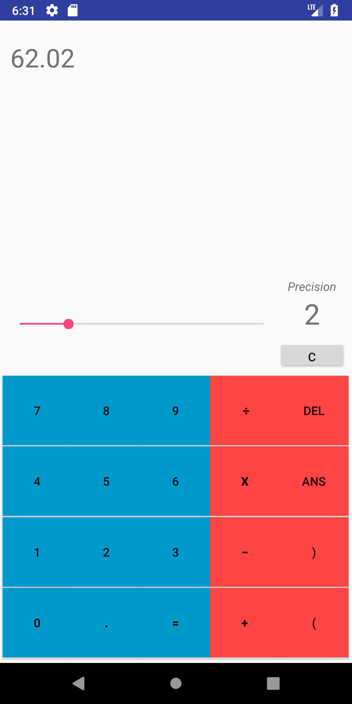
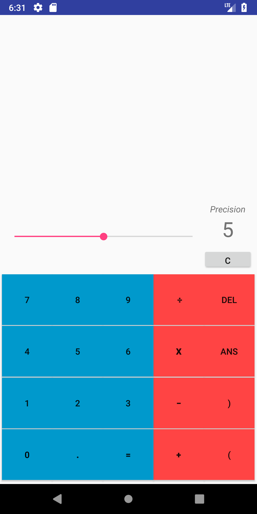

## CALCULATOR 

A simple Android calculator app built with Java.

Makes use of shunting yard algorithm.

## INFO
I made the initial blunder of initially neglecting gitignore on this project. So I made this repository. Therefore, none of my initial commits are here.

A very simple calculator that I made to acquaint myself with Android Studio. Based on a project I had already done before. Not to be updated beyond a basic level as I will move on to projects I am more interested in.

Supports simple operations such as additon,multiplication,division,subtraction as well as support for the unary operator, and parantheses (not nested). Also includes a precision slider.

Note: This is optimized for the Pixel 2 XL, I did not reallly pay attention to scaling/constraint layouts since this was my first app. While it does scale properly to small screens, the proportions aren't very pretty.

## MEDIA

## NOTICE

App icon made by SmashIcons from www.flaticon.com. 
If you decide to use this code, please either add this attrition or change the icon!

## LICENSE

MIT License, feel free to use the code as you please
